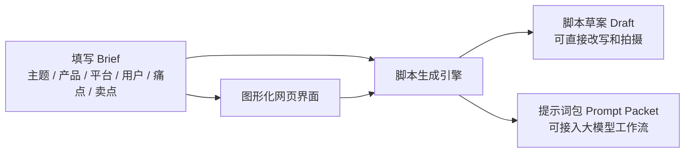

<div align="center">
  <h1>短视频脚本生成工作台</h1>
  <p><strong>ShortVideoScriptStudio</strong></p>
  <p>从结构化 Brief 到可拍、可剪、可继续优化的短视频脚本</p>
  <p>A Chinese-first studio for turning content briefs into shoot-ready short video scripts.</p>
  <p>
    <a href="https://github.com/Tsinghua-Man/ShortVideoScriptStudio/actions/workflows/ci.yml">
      
    </a>
  </p>
</div>

一个面向中文创作者、内容团队和 AI 产品原型开发者的短视频脚本生成智能体项目。

它不是只给你几段“像广告词”的文本，而是把短视频脚本生成拆成一套更适合真实创作工作流的工作台：

- 结构化 brief 输入
- 专业脚本生成逻辑
- 中文图形化网页界面
- 命令行生成入口
- 可继续接入大模型或工作流的提示词包模式

如果你想快速做出一版可拍、可改、可协作、可继续优化的短视频脚本，这个项目就是围绕这件事设计的。

## 产品预览


上图展示的是项目当前的本地网页工作台：左侧填写主题、平台、目标用户、痛点和卖点，右侧直接生成脚本结果。  
页面支持两种使用方式：

- 启动本地 Web 服务后在浏览器中使用
- 直接双击 `web/index.html` 进入浏览器本地生成模式

## 使用前后对比

### 输入前：创作者通常只有一份零散需求

```text
主题：敏感肌修护精华分享
平台：抖音
目标：转化
时长：45 秒
用户：25-35 岁容易泛红的女性上班族
痛点：泛红、卡粉、总踩雷
卖点：轻薄不黏、妆前可用、舒缓感更明显
```

### 生成后：工具会整理成可继续拍摄和改稿的脚本结构

```text
需求理解
- 视频目标
- 目标用户
- 核心主题
- 核心痛点
- 核心卖点

内容策略
- 核心角度
- 情绪抓手
- 平台适配

主脚本
- 按时间段拆分镜头、口播、字幕重点、节奏建议

补充输出
- 备选开头
- 标题建议
- 拍摄与剪辑提示
- 默认假设与信息缺口
```

这让结果更像“可执行的短视频脚本草案”，而不只是几段散乱文案。

## 为什么这个项目值得看

很多“脚本生成工具”只会直接堆文案，但真实短视频创作更需要的是：

- 先理解视频目标，而不是直接输出词藻
- 先理解用户痛点，而不是只写产品卖点
- 输出能拍、能剪、能口播的脚本结构
- 在信息不完整时仍然继续生成，而不是卡住

这个项目当前已经支持：

- 根据平台、目标、时长、脚本类型生成结构化脚本
- 输出需求理解、内容策略、主脚本表格、备选开头、标题建议、拍摄提示
- 支持 `draft` 脚本草案模式和 `prompt` 提示词包模式
- 支持本地 Web UI 填表生成
- 支持直接双击 `index.html` 离线使用

## 适合谁

- 想快速出短视频脚本初稿的内容创作者
- 做口播、带货、测评、剧情、探店内容的账号操盘者
- 想把“脚本生成能力”接进工作流、大模型平台或智能体系统的开发者
- 想做中文创作型 AI 产品原型的人

## 一眼看懂它能做什么



## 核心亮点

### 1. 输入方式更适合真实创作

不是一句话提问，而是结构化填写：

- 视频主题
- 产品 / 服务
- 发布平台
- 视频目标
- 脚本类型
- 目标用户
- 用户痛点
- 核心卖点
- 证明点
- CTA

这让生成出来的结果更像“短视频策划草案”，而不只是普通文案。

### 2. 输出结构更像编导工作流

生成结果不是一整坨文本，而是包含：

- 需求理解
- 内容策略
- 主脚本表格
- 备选开头
- 标题建议
- 拍摄与剪辑提示
- 信息缺口与默认假设

### 3. 两种运行模式，适合不同场景

| 模式 | 适合场景 | 入口 |
| --- | --- | --- |
| 命令行模式 | 批量测试、接脚本、后续接 API | `src/short_video_agent.py` |
| 本地网页模式 | 直观填表、演示、给非技术用户使用 | `src/web_app.py` |
| 浏览器离线模式 | 不启动服务，直接打开网页就用 | `web/index.html` |

### 4. 对不完整输入更友好

当你没有把信息填满时，它不会直接停止，而是会：

- 自动补充默认假设
- 明确告诉你缺了什么
- 方便下一轮继续优化

## 快速体验

### 方式一：最快体验网页界面

```bash
python src/web_app.py --open
```

Windows 也可以直接双击：

- `start_web_ui.bat`

默认地址：

```text
http://127.0.0.1:8123
```

### 方式二：直接双击 HTML 页面

直接打开：

```text
web/index.html
```

页面会自动切换为“浏览器本地生成模式”，即使没有启动 Python 本地服务，也能正常生成脚本。

### 方式三：命令行生成脚本

```bash
python src/short_video_agent.py --brief examples/sample_brief.json --mode draft
```

生成提示词包：

```bash
python src/short_video_agent.py --brief examples/sample_brief.json --mode prompt
```

保存到文件：

```bash
python src/short_video_agent.py --brief examples/sample_brief.json --mode draft --output output.md
```

## 输出示例

脚本草案会生成这样的结构：

```text
# 专业短视频脚本草案

## 需求理解
## 内容策略
## 主脚本
## 备选开头
## 标题建议
## 拍摄与剪辑提示
## 信息缺口与默认假设
```

这意味着它更适合继续打磨、给团队协作、或者接进下一步内容生产流程。

## 项目结构

```text
.
├─ assets/
│  └─ web-ui-preview.png
├─ agent/
│  ├─ system_prompt.md
│  ├─ input_template.json
│  ├─ output_contract.md
│  └─ evaluation_checklist.md
├─ examples/
│  └─ sample_brief.json
├─ src/
│  ├─ short_video_agent.py
│  └─ web_app.py
├─ web/
│  ├─ index.html
│  ├─ styles.css
│  ├─ app.js
│  ├─ client_generator.js
│  └─ standalone_data.js
├─ start_agent.bat
├─ start_web_ui.bat
└─ USAGE_CN.md
```

## 开发说明

### 本地检查

```bash
python -m py_compile src/short_video_agent.py src/web_app.py
python src/web_app.py --check
node --check web/standalone_data.js
node --check web/client_generator.js
node --check web/app.js
```

### 关键文件职责

- `src/short_video_agent.py`
  - 命令行生成入口和核心脚本逻辑
- `src/web_app.py`
  - 本地 Web 服务和接口
- `web/app.js`
  - 前端交互和双模式启动逻辑
- `web/client_generator.js`
  - 浏览器本地离线生成逻辑
- `web/standalone_data.js`
  - 离线模式下使用的字段配置和示例数据

## GitHub Actions

仓库已包含基础 CI，会在 push 和 pull request 时自动执行：

- Python 语法检查
- Web UI 烟雾测试
- 前端脚本语法检查
- 离线生成器最小验证

## 文档入口

- 使用教程：[USAGE_CN.md](./USAGE_CN.md)
- 贡献说明：[CONTRIBUTING.md](./CONTRIBUTING.md)
- 项目深度讲解：[docs/项目详解与本科生快速上手指南.md](./docs/%E9%A1%B9%E7%9B%AE%E8%AF%A6%E8%A7%A3%E4%B8%8E%E6%9C%AC%E7%A7%91%E7%94%9F%E5%BF%AB%E9%80%9F%E4%B8%8A%E6%89%8B%E6%8C%87%E5%8D%97.md)

## Roadmap

- 增加行业模板：美妆、教育、餐饮、本地生活、知识 IP 等
- 一次生成多版本脚本
- 更细的平台风格开关
- 结果区卡片化展示
- 接入真实模型 API

## License

当前仓库暂未添加开源许可证。

如果你准备正式公开分发或接受更广泛贡献，建议下一步补充 `LICENSE` 文件。
