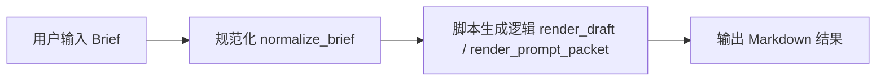

# 项目详解与本科生快速上手指南

> 项目名称：`ShortVideoScriptStudio`
>
> 目标：帮助你从“看不懂这个项目”快速走到“我知道它的核心、能自己改代码、能继续扩展功能”。

---

## 1. 先用一句人话讲清楚：这个项目到底是什么

这个项目本质上是一个 **短视频脚本生成器**。

你给它一份结构化需求，比如：

- 主题是什么
- 产品是什么
- 发在哪个平台
- 目标是涨粉还是转化
- 用户是谁
- 痛点是什么
- 卖点是什么

它会输出一份更像“编导草案”的结果，而不是只吐几句零散文案。

它的输出通常包含：

- 需求理解
- 内容策略
- 主脚本表格
- 备选开头
- 标题建议
- 拍摄与剪辑提示
- 信息缺口与默认假设

所以你可以把它理解成：

> 一个把“短视频需求表”自动转换成“可拍摄脚本草案”的工具。

---

## 2. 这个项目最核心的思想是什么

如果你只记住一件事，请记住这一件：

> **这个项目的核心不是网页，而是“脚本生成规则”。**

网页只是一个输入和展示壳子。

真正核心的是下面这条链路：



整个项目其实围绕这条链路做了三种入口：

1. 命令行入口
2. Python Web 服务入口
3. 浏览器离线入口

换句话说：

- **输入方式** 可以变
- **展示方式** 可以变
- **核心生成规则** 才是最重要的

这也是这个项目设计得比较聪明的地方。

---

## 3. 项目的整体结构怎么理解

先看目录：

```text
.
├─ assets/
│  └─ web-ui-preview.png
├─ agent/
│  ├─ system_prompt.md
│  ├─ input_template.json
│  ├─ output_contract.md
│  └─ evaluation_checklist.md
├─ docs/
│  └─ 项目详解与本科生快速上手指南.md
├─ examples/
│  └─ sample_brief.json
├─ src/
│  ├─ short_video_agent.py
│  └─ web_app.py
├─ web/
│  ├─ index.html
│  ├─ styles.css
│  ├─ app.js
│  ├─ client_generator.js
│  └─ standalone_data.js
├─ start_agent.bat
├─ start_web_ui.bat
├─ README.md
└─ USAGE_CN.md
```

你可以把它分成 5 个层次来理解。

### 第 1 层：规则层

在 `agent/` 目录下。

- `system_prompt.md`
  - 智能体的角色设定和输出原则
- `input_template.json`
  - 规定输入长什么样
- `output_contract.md`
  - 规定输出长什么样
- `evaluation_checklist.md`
  - 用来检查脚本质量

这一层相当于：

> “业务规则”和“内容标准”

它决定了脚本应该怎么写，不是程序怎么跑。

### 第 2 层：核心引擎层

在 `src/short_video_agent.py`。

这是整个项目最重要的文件。

它做三件事：

1. 清洗和补全用户输入
2. 生成脚本内容
3. 输出成 Markdown

这一层相当于：

> “真正会写脚本的人”

### 第 3 层：服务层

在 `src/web_app.py`。

这个文件做的事情是：

- 把网页需要的表单配置提供出来
- 接收网页传来的输入
- 调用 `short_video_agent.py`
- 把结果再返回给网页

这一层相当于：

> “前端和核心引擎之间的中间人”

### 第 4 层：前端界面层

在 `web/` 目录。

- `index.html`
  - 页面骨架
- `styles.css`
  - 页面样式
- `app.js`
  - 页面交互逻辑

这一层相当于：

> “用户看到的界面”

### 第 5 层：离线兜底层

也在 `web/` 目录，但单独理解：

- `client_generator.js`
  - 把 Python 的核心生成逻辑用 JavaScript 又写了一遍
- `standalone_data.js`
  - 给离线模式提供字段配置、示例数据、系统提示词

这一层存在的原因是：

> 用户直接双击 `index.html` 时，没有 Python 服务，也要能用。

这是这个项目一个非常关键的设计细节。

---

## 4. 你应该先掌握的 7 个关键词

在读代码前，先把这些概念搞懂。

### 4.1 Brief

`Brief` 就是“需求表”。

比如：

- topic
- platform
- goal
- audience
- pain_points
- selling_points

程序的第一步，不是直接生成脚本，而是先接收 brief。

### 4.2 normalize

`normalize` 的意思是“规范化”。

比如用户输入：

- 可能有字段没填
- 可能把数组写成了一整段字符串
- 可能写了 `duration_sec = abc`

程序要先把这些不规范输入整理成一个标准对象，这就是 normalize。

### 4.3 draft

`draft` 是脚本草案模式。

它输出的是最终给人看的脚本结构。

### 4.4 prompt packet

`prompt packet` 是提示词包模式。

它不是直接给拍摄者看，而是给：

- 大模型
- 工作流系统
- 智能体平台

使用的。

### 4.5 standalone

`standalone` 的意思是独立运行。

在这个项目里，指的是：

> 即使没有 Python 服务，网页也能自己生成脚本。

### 4.6 smoke test

`smoke test` 是“冒烟测试”。

意思是：

> 先快速验证项目最基本功能是不是活着。

不是做深度测试，而是做“最起码能不能跑”的测试。

### 4.7 render

`render` 可以理解成“把数据组织成最终展示内容”。

比如：

- `render_draft()`
  - 负责生成脚本草案
- `render_prompt_packet()`
  - 负责生成提示词包

---

## 5. 项目最重要的文件：`src/short_video_agent.py`

如果你时间有限，这个文件是你最应该精读的。

它相当于整个项目的大脑。

---

## 6. 先从这个文件的顶层常量开始理解

### 6.1 `ROOT` 和 `SYSTEM_PROMPT_PATH`

```python
ROOT = Path(__file__).resolve().parents[1]
SYSTEM_PROMPT_PATH = ROOT / "agent" / "system_prompt.md"
```

作用：

- 找到项目根目录
- 找到系统提示词文件

说明这个项目不是把所有内容都写死在 Python 里，而是把一部分业务规则放在 Markdown 文件里。

这是一个好习惯，因为：

- 改提示词不一定要改 Python 代码
- 规则和逻辑分离，更容易维护

### 6.2 `LIST_FIELDS`

```python
LIST_FIELDS = [
    "pain_points",
    "selling_points",
    "proof_points",
    "must_include",
    "must_avoid",
    "reference_accounts",
]
```

这表示哪些字段应该是“列表”。

比如：

- `pain_points`
  - 应该是多个痛点
- `selling_points`
  - 应该是多个卖点

为什么这个常量重要？

因为程序后面会根据它来判断：

- 该字段是不是要做拆分
- 该字段是不是要从字符串变成数组

### 6.3 `DEFAULTS`

这是默认值字典。

它的作用非常重要：

> 当用户输入不完整时，程序先拿默认值兜底。

比如：

- 平台默认 `抖音`
- 目标默认 `转化`
- 脚本类型默认 `口播`
- 时长默认 `45`

这样做的好处是：

- 用户不用每次都填完整
- 程序不会因为字段缺失就报错

### 6.4 `PLATFORM_NOTES`

这个字典定义不同平台的内容策略差异。

比如：

- 抖音：前 1 秒结论先行
- 小红书：更像经验分享
- 视频号：更重视信任建立

这说明这个项目不是“统一模板硬套所有平台”，而是有最基础的平台适配意识。

### 6.5 `GOAL_ANGLES`

这个字典定义不同目标下的视频策略。

比如：

- 转化：降低试错成本，让观众采取行动
- 涨粉：建立关注理由
- 获客：引导私信或咨询

这告诉你：

> 同一个主题，因为目标不同，脚本策略也应该不同。

### 6.6 `DEFAULT_CTA`

如果用户没写 CTA，程序会给一个默认 CTA。

这是一种“保底生成”的策略。

---

## 7. 输入清洗：为什么 `normalize_brief()` 是核心中的核心

这是整个 Python 引擎最关键的入口函数之一。

你可以把它理解成：

> “把用户乱七八糟的输入，变成程序愿意处理的标准格式”

---

## 8. `ensure_list()`：把字符串变成数组

这个函数看起来小，但很关键。

作用：

- 如果本来就是列表，直接清洗
- 如果是字符串，就按分隔符拆开
- 支持中文逗号、英文逗号、顿号、分号、斜杠、换行

也就是说，这些输入都能正常变成列表：

```text
痛点1,痛点2
```

```text
痛点1、痛点2
```

```text
痛点1
痛点2
```

这就是为什么网页里提示“每行一条”是可以成立的。

---

## 9. `clean_text()`：统一去空格

这个函数做的事情很简单：

- `None` 变成空字符串
- 其他内容转成字符串再 `strip()`

虽然简单，但这是很多程序稳定性的基础。

---

## 10. `normalize_brief()` 详细拆解

这个函数你一定要读懂。

它做了下面几件事。

### 第一步：把默认值和原始输入合并

```python
brief: dict[str, Any] = DEFAULTS.copy()
brief.update(raw)
```

意思是：

- 先拿一份默认配置
- 再用用户输入覆盖默认值

### 第二步：清洗普通文本字段

不是列表字段的，会走 `clean_text()`。

这样可以保证：

- 空值统一
- 字符串两边多余空格被去掉

### 第三步：清洗列表字段

列表字段会走 `ensure_list()`。

这是让这个项目对“输入格式不严格”更宽容的重要原因。

### 第四步：修正视频时长

```python
brief["duration_sec"] = max(15, min(duration_sec, 180))
```

意思是：

- 小于 15 秒，强制拉到 15
- 大于 180 秒，强制压到 180

这是一种“业务约束”。

### 第五步：自动补 `topic`

如果没写主题：

- 优先用 `product_or_service`
- 再用 `industry`
- 还不行就写“短视频主题待补充”

### 第六步：自动补 `product_or_service`

如果没写产品/服务，就直接等于主题。

### 第七步：自动补平台、目标、脚本类型

这一段就是兜底。

### 第八步：自动补 CTA

如果没写 CTA，就根据 `goal` 自动生成一条默认 CTA。

### 第九步：生成 assumptions

这一段非常值得你学习。

程序不会简单说“你没填这个字段，我没法生成”，而是：

- 把缺失项列出来
- 给出默认处理方式
- 记录到 `brief["assumptions"]`

这是一种非常好的产品思路：

> 不把用户输入不完整当成系统失败，而是当成需要解释清楚的现实情况。

---

## 11. 时间切分逻辑：为什么脚本能自动分段

对应函数：

- `allocate_seconds()`
- `build_time_ranges()`

### 它们在做什么

程序会把整个视频时长，比如 45 秒，按比例拆成 5 个阶段：

- 开头抓停
- 放大痛点
- 给出解决路径
- 建立信任
- 收束 CTA

不是平均分，而是按权重：

```python
[0.16, 0.2, 0.24, 0.24, 0.16]
```

也就是说中间信息密度更高，头尾更短。

这符合短视频的一般节奏。

### 这背后的设计思想

这个项目不是“先写一大段文本再随便切”，而是：

> 先有一个内容结构，再把时间分配给结构。

这就是它比普通文案工具更像“脚本工具”的地方。

---

## 12. `get_items()`：把输入压缩成“生成时要反复用的变量”

这个函数本质上是一个中间层。

它把 `brief` 中的一堆字段提炼成短变量，比如：

- `pain`
- `pain2`
- `sell`
- `sell2`
- `proof`
- `audience`
- `cta`

为什么要这么做？

因为后面很多模板字符串都需要这些值。

如果每次都写：

```python
brief["selling_points"][0]
```

会很丑，也容易出错。

所以这里相当于把数据整理成“模板渲染专用变量包”。

---

## 13. `build_hook_options()`：开头钩子的生成策略

这是脚本创作里非常关键的一块。

它根据 `script_type` 不同，生成不同风格的开头。

比如：

- 知识分享
  - 更强调误区、认知偏差
- 测评
  - 更强调标准、踩雷、判断依据
- 剧情
  - 更强调冲突
- 探店
  - 更强调体验和发现感
- 默认口播
  - 更强调痛点和判断逻辑

这一段体现了项目的一个重要设计原则：

> 脚本类型不只是字段不同，而是内容逻辑不同。

---

## 14. `build_titles()`：标题建议其实是一个轻量策略层

它不是完全自由生成，而是围绕几个固定策略：

- 痛点切入
- 避坑切入
- 限时讲清
- 卖点反差

这说明这个项目目前是：

> “规则驱动 + 模板驱动”

而不是完全开放式生成。

这对初版产品是很合理的，因为：

- 更稳定
- 更容易控制输出格式
- 更容易测试

---

## 15. `build_content_strategy()`：脚本前的策划摘要

这个函数不会直接写台词，而是先写：

- 核心角度
- 情绪抓手
- 说服路径
- 平台适配
- 目标导向

这非常像真正做内容策划时会先写的“脚本策略摘要”。

所以它的作用是：

> 让输出结果不只是脚本，还有“脚本为什么这么写”的解释。

这对内容团队尤其有用。

---

## 16. `build_scene_blueprint()`：这个项目最像“编导模板”的地方

这个函数非常值得你重点看。

它定义了脚本的五段式骨架。

默认是这 5 段：

1. 抓停开场
2. 放大痛点
3. 给出解决路径
4. 建立信任
5. 收束与 CTA

每一段都包含：

- `purpose`
  - 这一段的目标
- `visual`
  - 镜头怎么拍
- `voice`
  - 人怎么说
- `subtitle`
  - 字幕怎么打
- `rhythm`
  - 节奏建议

这说明项目输出的不是“纯文案”，而是一个弱分镜脚本。

### 为什么这个设计很重要

因为短视频不是只看文案，而是同时涉及：

- 口播
- 镜头
- 字幕
- 节奏

这个函数正是在显式表达这四件事。

### 它怎么支持不同脚本类型

函数先创建一个 `common` 模板，再根据 `script_type` 去局部替换某些段落。

这是一种很典型的编程方式：

- 先有公共模板
- 再做差异化改写

这个结构非常利于扩展。

如果你以后想加新类型，比如：

- 访谈
- Vlog
- 直播切片

就可以照这个思路扩展。

---

## 17. `render_table()`：最终把脚本骨架渲染成表格

这个函数把：

- 时间段
- 目的
- 镜头
- 口播
- 字幕
- 节奏

拼成 Markdown 表格。

这一段技术上不复杂，但产品上很重要。

因为它让输出结果：

- 更结构化
- 更容易复制
- 更适合直接放进文档或协作平台

---

## 18. `render_draft()`：最终成品生成函数

这是脚本草案模式的总装函数。

它会：

1. 调 `get_items()`
2. 调 `build_hook_options()`
3. 调 `build_titles()`
4. 调 `build_content_strategy()`
5. 调 `render_table()`
6. 拼接成最终 Markdown

你可以把它理解成：

> 把各个模块拼成最终脚本成品的“总导演”

---

## 19. `render_prompt_packet()`：为什么这个项目不仅是脚本器，还是智能体中间层

这个函数会输出：

- 系统提示词
- 结构化 brief
- 用户任务说明

这意味着这个项目不只是自己生成脚本，还能把自己当成“上游工具”。

比如你后面可以把它接到：

- ChatGPT API
- Dify
- Coze
- LangChain
- 其他工作流平台

所以这个项目有双重身份：

1. 一个直接生成脚本的工具
2. 一个给更强模型准备输入的“预处理器”

---

## 20. 命令行入口是怎么工作的

对应函数：

- `parse_args()`
- `main()`

逻辑很标准：

1. 读取命令行参数
2. 解析 brief 文件
3. 根据 `mode` 选择 `draft` 或 `prompt`
4. 输出到终端或文件

这部分对你以后接批处理、接自动化任务很重要。

---

## 21. 第二个核心文件：`src/web_app.py`

这个文件负责把 Python 核心逻辑包装成一个本地网页服务。

它可以理解为：

> “一个很轻量的后端”

它没有用 Flask、FastAPI、Django，而是直接用了 Python 标准库。

这有几个好处：

- 依赖少
- 运行简单
- 更适合本地工具型项目

---

## 22. `web_app.py` 为什么没有用 Flask

这是一个很好的学习点。

很多人一做 Web 项目就上框架，但这个项目没有。

原因很简单：

- 它只需要两个 API
  - `/api/bootstrap`
  - `/api/generate`
- 只服务本地使用
- 不需要数据库
- 不需要复杂中间件

所以用标准库完全够用。

这是“技术选型不过度”的一个例子。

---

## 23. `FIELD_GROUPS`：前端表单其实是后端配置出来的

这是 `web_app.py` 里很重要的设计。

`FIELD_GROUPS` 不是随便写来看的，它是表单元数据。

每个字段包括：

- `name`
  - 程序字段名
- `label`
  - 中文显示名
- `type`
  - 输入框类型
- `placeholder`
  - 占位提示
- `options`
  - 下拉列表项

这意味着前端不是手写死所有表单，而是根据这份配置动态生成。

这是一种常见而且很好的设计：

> “用数据描述表单，而不是手写每个表单项”

---

## 24. `bootstrap_payload()`：网页初始化需要什么数据

这个函数返回：

- `field_groups`
- `sample_brief`
- `mode_labels`

也就是说，网页第一次加载时，前端需要知道：

1. 该渲染什么表单
2. 示例数据是什么
3. 模式显示名是什么

所以 `/api/bootstrap` 的作用就是：

> 给前端一份“启动包”

---

## 25. `AppHandler`：这是后端请求入口

这是一个继承自 `SimpleHTTPRequestHandler` 的类。

它处理两类请求：

### `GET`

- 访问首页
- 访问静态资源
- 访问 `/api/bootstrap`

### `POST`

- 访问 `/api/generate`

这是整个 Web 服务的核心入口。

---

## 26. `do_GET()` 的工作流程

如果路径是：

- `/api/bootstrap`
  - 返回 JSON
- `/`
  - 返回 `index.html`
- 其他
  - 当成静态文件处理

这说明这个服务同时承担了：

- 前端静态资源服务器
- 后端接口服务器

---

## 27. `do_POST()` 的工作流程

这是网页生成按钮真正打到的地方。

流程是：

1. 检查路径是不是 `/api/generate`
2. 读取请求体 JSON
3. 校验 `mode`
4. 校验 `brief`
5. 调 `normalize_brief()`
6. 根据模式调 `render_draft()` 或 `render_prompt_packet()`
7. 返回 JSON

这个流程你可以概括成：

```text
前端表单 -> POST /api/generate -> Python 引擎 -> JSON 响应
```

---

## 28. `smoke_test()`：这是测试意识最强的地方之一

这个函数做了很多事：

- 检查前端资源文件是否存在
- 检查 Python 生成逻辑是否正常
- 检查首页 HTML 是否能返回
- 检查 JS 和 CSS 是否能返回
- 检查 `/api/bootstrap` 是否正常
- 检查 `/api/generate` 是否正常
- 检查错误请求是否返回正确报错

这已经不只是“能不能跑”，而是一个非常像工程项目的最小集成测试。

对你来说，这个函数是很值得学习的。

---

## 29. 第三个核心部分：前端 `web/app.js`

这个文件负责：

- 页面初始化
- 渲染表单
- 绑定按钮事件
- 收集用户输入
- 调用后端或离线生成器
- 展示结果

你可以把它理解成：

> “浏览器里的总控器”

---

## 30. 前端状态 `state` 在做什么

前端里有一个 `state` 对象，保存了运行时状态。

比如：

- `fieldGroups`
  - 表单结构
- `sampleBrief`
  - 示例输入
- `latestResult`
  - 最近一次生成结果
- `latestMode`
  - 最近一次模式
- `runtimeSource`
  - 当前是 `server` 还是 `standalone`
- `apiAvailable`
  - 当前还能不能走后端接口

这就是一个很标准的前端思路：

> 用一个状态对象统一管理页面运行信息。

---

## 31. 为什么页面有时候走服务器，有时候不走

这正是这个项目最巧妙的地方之一。

看 `loadBootstrap()` 的逻辑：

### 情况 1：你直接双击 HTML

此时协议是 `file://`

页面会直接切到离线模式，使用：

- `standalone_data.js`
- `client_generator.js`

### 情况 2：你正常启动本地服务

此时协议是 `http://`

页面优先访问 `/api/bootstrap`

### 情况 3：本来连着服务，但服务突然不可用

页面会自动回退到浏览器本地生成模式。

这意味着这个项目不是单一运行模式，而是：

> 一套前端，兼容两种后端来源。

这是你理解整个项目时最关键的结构点之一。

---

## 32. `renderForm()`：为什么网页里的表单是动态生成的

这个函数会遍历 `fieldGroups`，把每个 section 渲染成 HTML。

好处是：

- 改一个字段配置，就能影响整个表单
- 前后端字段命名统一
- 不容易出现“前端字段名和后端字段名不一致”的问题

这也是为什么 `web_app.py` 里的 `FIELD_GROUPS` 很重要。

---

## 33. `collectBrief()`：前端怎么把表单重新收集成对象

这个函数会遍历所有字段，把值组装回一个 `brief` 对象。

注意这里有个小细节：

- 如果字段类型是数字，会把字符串转成数字
- 否则保留字符串

这意味着前端输出给后端的结构，是和后端 `normalize_brief()` 对接的。

---

## 34. `persistCurrentBrief()` 和 `readStoredBrief()`：为什么刷新后表单还在

这里用到了浏览器的 `localStorage`。

作用：

- 用户一边输入，一边保存
- 页面刷新后可以恢复

这不是脚本生成核心逻辑，但它是很重要的“产品体验细节”。

---

## 35. `generate()`：网页按钮点击后真正发生了什么

这是前端最关键的函数。

流程如下：

1. 进入 loading 状态
2. 收集表单数据
3. 判断当前有没有后端可用
4. 有后端则调用 `generateWithServer()`
5. 如果后端失败，则自动回退到 `generateWithClient()`
6. 把结果展示到右侧
7. 启用复制和下载按钮

这说明这个函数其实不只是“发请求”，而是：

> 一个带容错回退逻辑的统一生成入口。

---

## 36. `generateWithServer()` 与 `generateWithClient()` 的区别

### `generateWithServer()`

通过 `fetch("/api/generate")` 调 Python 后端。

适合：

- 服务已启动
- 想复用 Python 核心逻辑

### `generateWithClient()`

直接调用浏览器里的 `ShortVideoClientGenerator`。

适合：

- 离线使用
- 直接双击 HTML
- 本地服务不可用时兜底

这个双模式设计，是你以后扩展项目时必须非常小心维护的一部分。

---

## 37. 为什么还有一个 `web/client_generator.js`

这个文件是整个项目的一个“镜像引擎”。

你会发现它做了和 Python 很相似的事情：

- `normalizeBrief()`
- `buildHookOptions()`
- `buildTitles()`
- `buildContentStrategy()`
- `renderDraft()`
- `renderPromptPacket()`

也就是说：

> Python 写了一套生成逻辑，JavaScript 又写了一套。

### 这是重复代码吗

是的，从工程上说，这是重复逻辑。

### 为什么要这样做

因为要支持：

> 直接双击 `index.html` 也能用

所以这里是一个典型的权衡：

- 缺点：逻辑有重复，维护成本变高
- 优点：项目的可用性大幅提升

这就是你以后做工程时经常会遇到的现实问题：

> 不是所有重复都是坏事，关键看它换来了什么。

---

## 38. `standalone_data.js` 为什么存在

这个文件给离线模式提供三种东西：

1. 表单字段配置
2. 示例 brief
3. 系统提示词

因为离线模式不能访问 `/api/bootstrap`，所以必须把这些数据放在前端本地文件里。

这意味着：

- 在线模式的数据来自 Python
- 离线模式的数据来自 JS 文件

所以它们必须尽量保持一致。

---

## 39. `web/index.html` 为什么很薄

这个文件本身并不复杂。

因为它只负责：

- 页面大框架
- 占位容器
- 挂载脚本文件

真正复杂的是：

- 交互逻辑在 `app.js`
- 离线生成逻辑在 `client_generator.js`
- 数据配置在 `standalone_data.js`

这是一种典型前端结构：

> HTML 管结构，CSS 管样式，JS 管行为。

---

## 40. CSS 为什么在这个项目里不是核心

`web/styles.css` 做得不错，但从学习项目核心的角度讲，它不是第一优先级。

如果你的目标是：

- 读懂业务
- 改逻辑
- 扩展功能

那你应该先看：

1. `src/short_video_agent.py`
2. `src/web_app.py`
3. `web/app.js`
4. `web/client_generator.js`

然后再回头看 CSS。

---

## 41. 三种运行方式，你要怎么理解

这个项目有三种跑法。

### 方式一：命令行模式

```bash
python src/short_video_agent.py --brief examples/sample_brief.json --mode draft
```

适合：

- 调试核心逻辑
- 验证脚本输出
- 后续接自动化流程

### 方式二：本地 Web 服务模式

```bash
python src/web_app.py --open
```

适合：

- 人工填表
- 演示给别人看
- 本地产品化体验

### 方式三：直接双击 HTML

```text
web/index.html
```

适合：

- 快速试用
- 无 Python 服务场景
- 离线环境

### 你应该优先用哪种方式学项目

建议顺序：

1. 先用命令行看输出
2. 再用网页理解交互
3. 最后再研究离线模式

---

## 42. 如果你想快速掌握这个项目，推荐阅读顺序

### 第一遍：理解业务目标

读这些文件：

- `README.md`
- `USAGE_CN.md`
- `agent/system_prompt.md`
- `agent/input_template.json`
- `agent/output_contract.md`

目标是回答：

- 这个项目解决什么问题？
- 输入是什么？
- 输出是什么？

### 第二遍：理解核心引擎

读：

- `src/short_video_agent.py`

重点看：

- `normalize_brief()`
- `get_items()`
- `build_hook_options()`
- `build_scene_blueprint()`
- `render_draft()`
- `render_prompt_packet()`

### 第三遍：理解网页层

读：

- `src/web_app.py`
- `web/app.js`

重点看：

- `/api/bootstrap`
- `/api/generate`
- `generate()`
- `generateWithServer()`
- `generateWithClient()`

### 第四遍：理解离线模式

读：

- `web/client_generator.js`
- `web/standalone_data.js`

---

## 43. 这个项目有哪些“工程上很聪明”的点

### 43.1 规则和逻辑分离

系统提示词、输入模板、输出规范不全写死在 Python 里，而是拆到 `agent/` 下。

### 43.2 先标准化输入，再生成输出

这是所有稳定生成器都该做的事。

### 43.3 输出不是纯文本，而是结构化 Markdown

更适合协作和再加工。

### 43.4 支持双模式网页

既能连 Python 服务，也能浏览器离线运行。

### 43.5 有基础 smoke test

这说明作者不是只写“能跑一次”的代码，而是开始有工程思维了。

---

## 44. 这个项目有哪些局限

你要学会既看优点，也看局限。

### 44.1 核心生成逻辑偏模板驱动

当前生成是规则化、模板化为主，还不是真正接大模型实时生成。

### 44.2 Python 和 JavaScript 有重复逻辑

为了支持离线模式，维护成本会增加。

### 44.3 没有数据库

所以：

- 没有用户系统
- 没有历史记录系统
- 没有项目管理功能

### 44.4 还没有行业模板体系

虽然已经支持多脚本类型，但还没有按行业做更细颗粒度模板。

这些不是缺点，而是你以后可以继续做的方向。

---

## 45. 如果你要自己改这个项目，最常见的 8 种需求怎么改

### 45.1 新增一个平台

要改：

- `src/short_video_agent.py` 里的 `PLATFORM_NOTES`
- `src/web_app.py` 里的 `FIELD_GROUPS`
- `web/standalone_data.js` 里的字段配置
- `web/client_generator.js` 里的 `PLATFORM_NOTES`

### 45.2 新增一个脚本类型

要改：

- `src/short_video_agent.py`
  - `build_hook_options()`
  - `build_scene_blueprint()`
- `src/web_app.py`
  - 下拉选项
- `web/standalone_data.js`
  - 下拉选项
- `web/client_generator.js`
  - 对应逻辑

### 45.3 新增一个输入字段

要改：

- `agent/input_template.json`
- `src/short_video_agent.py`
  - `DEFAULTS`
  - 可能还要改 `get_items()` 或渲染函数
- `src/web_app.py`
  - `FIELD_GROUPS`
- `web/standalone_data.js`
  - `fieldGroups`
- `web/app.js`
  - 一般不需要大改，因为表单是动态生成的

### 45.4 修改脚本输出结构

要改：

- `agent/output_contract.md`
- `src/short_video_agent.py`
  - `render_draft()`

### 45.5 修改脚本质量标准

要改：

- `agent/evaluation_checklist.md`

### 45.6 修改默认 CTA 逻辑

要改：

- `src/short_video_agent.py` 的 `DEFAULT_CTA`
- `web/client_generator.js` 的 `DEFAULT_CTA`

### 45.7 修改网页显示文案

要改：

- `web/index.html`
- `web/app.js`
- `src/web_app.py`
  - 如果这个文案来自后端配置

### 45.8 想把它接到真实大模型

大概率要改：

- `src/short_video_agent.py`
  - 在 `render_draft()` 之前或之后接 API
- 或者新增一个新的生成层文件

---

## 46. 你最应该亲手做的 5 个练习

如果你想真正掌握，而不是“看懂一点点”，我建议你自己做这 5 个练习。

### 练习 1：新增一个脚本类型 `访谈`

目标：

- 会改前后端统一配置
- 会改生成逻辑

### 练习 2：新增一个平台 `视频号直播切片`

目标：

- 学会平台策略如何接入

### 练习 3：给输出增加一个 `评论区互动建议`

目标：

- 学会改输出结构

### 练习 4：把示例 brief 改成你自己的行业

目标：

- 理解输入如何影响输出

### 练习 5：把网页结果区改成分块卡片展示

目标：

- 学会前端显示层改造

---

## 47. 作为本科生，你最容易卡住的点

### 卡点 1：觉得代码多，不知道先看哪里

解决：

先看 `src/short_video_agent.py`

### 卡点 2：不知道前端和后端怎么通信

解决：

记住这条链：

```text
表单 -> app.js -> /api/generate -> web_app.py -> short_video_agent.py
```

### 卡点 3：为什么 JS 里又写了一遍生成逻辑

解决：

因为要支持离线模式。

### 卡点 4：看不懂“模板驱动”

解决：

把它理解成：

> 先写好骨架，再往骨架里填数据。

### 卡点 5：不知道怎么开始修改

解决：

先做小改动：

- 改一个平台文案
- 改一个开头模板
- 改一个 CTA 默认值

不要一上来就做大重构。

---

## 48. 一句话总结每个关键文件

### `agent/system_prompt.md`

告诉智能体“你是谁、该怎么写”。

### `agent/input_template.json`

告诉系统“用户应该提供什么输入”。

### `agent/output_contract.md`

告诉系统“输出应该长什么样”。

### `src/short_video_agent.py`

整个项目的大脑，负责真正生成脚本。

### `src/web_app.py`

把 Python 大脑包装成网页接口。

### `web/index.html`

页面结构骨架。

### `web/app.js`

页面交互控制中心。

### `web/client_generator.js`

浏览器版脚本生成引擎。

### `web/standalone_data.js`

离线模式的数据和配置来源。

---

## 49. 这个项目最核心的代码阅读主线

如果你只按一条主线读，请按下面走：

```text
用户填表
-> collectBrief()
-> generate()
-> generateWithServer() / generateWithClient()
-> normalize_brief() / normalizeBrief()
-> render_draft() / renderDraft()
-> 页面展示结果
```

只要你真正读懂这条链，你就已经掌握这个项目 70% 的核心了。

---

## 50. 你现在应该怎么继续学

我建议你按下面的节奏来。

### 第一天

- 先跑通 3 种运行方式
- 通读这份文档
- 对照 `src/short_video_agent.py`

### 第二天

- 读 `src/web_app.py`
- 读 `web/app.js`
- 画出自己的调用流程图

### 第三天

- 改一个小功能
- 再跑一遍项目
- 自己写一份“我改了什么”的记录

这样你会从“能看懂”走到“能动手改”。

---

## 51. 最后的总总结

这个项目最核心的本质，可以用三句话概括：

1. 它是一个把结构化需求转成短视频脚本草案的工具。
2. 它的真正核心在 `src/short_video_agent.py`，不是在网页外观。
3. 它最大的工程特点是：同一套脚本生成思想同时支持命令行、Python Web 服务和浏览器离线模式。

如果你已经读到这里，那么你应该已经能回答下面这些问题：

- 这个项目解决什么问题？
- 输入是什么？
- 输出是什么？
- Python 核心在哪？
- 前后端怎么协作？
- 为什么有离线模式？
- 如果我要新增功能，应该改哪里？

如果你能回答这些，你就已经不再是“看不懂这个项目的人”，而是进入“可以继续维护和扩展这个项目的人”了。

---

## 52. 给你的下一步建议

如果你想继续快速变强，最推荐你下一步做的是：

1. 让我带你逐行精读 `src/short_video_agent.py`
2. 让我带你做一个最小功能修改，比如新增脚本类型
3. 让我再给你出一份“这个项目的面试式问答清单”

如果你愿意，我下一步可以继续直接给你做：

> **《short_video_agent.py 逐行源码精读版》**

那会比这份文档更细，接近“老师带你上课”的讲法。
